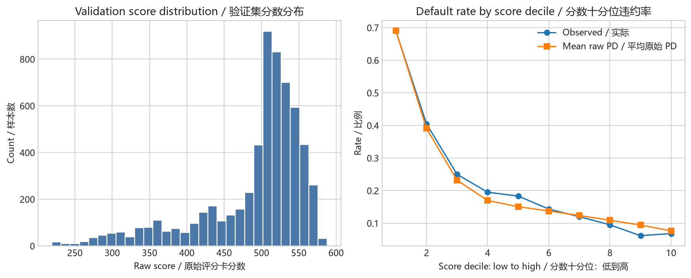

# 评分卡开发报告（中文）

运行 ID：`p2_scorecard_20260921`。本报告由 `credit_risk.scorecard` 实际执行生成。模型开发只使用固定训练集和验证集；测试标签未加载到评分卡开发数据对象中。

## 训练与参数选择

评分卡采用 `WOETransformer → LogisticRegression`，不使用类别权重。`C ∈ [0.01, 0.1, 1.0, 10.0]` 仅在 18,000 条训练数据内部进行 5 折分层交叉验证；每折重新拟合分箱、WOE 和逻辑回归。主指标是平均 ROC-AUC，其次是平均 Brier Score，完全并列时选择更小的 `C`。实际选中 `C=0.01`。

| C | Mean ROC-AUC | ROC-AUC SD | Mean Brier | Total seconds |
| --- | --- | --- | --- | --- |
| 0.01 | 0.773224 | 0.010455 | 0.136284 | 0.66 |
| 0.1 | 0.773076 | 0.010838 | 0.136179 | 0.68 |
| 1 | 0.772428 | 0.011062 | 0.136228 | 0.74 |
| 10 | 0.772128 | 0.011067 | 0.136257 | 0.73 |

数据 SHA-256：`30c6be3abd8dcfd3e6096c828bad8c2f011238620f5369220bd60cfc82700933`；配置 SHA-256：`132eb3dbf392cb1f54a4e95a3d92abb2ff51a8587bb76f8904164aad364a39ea`；切分清单 SHA-256：`dddcf606116ff3a5c91be58c126598234b6483a06a961c30a8cff2aea3a8b692`。

## 分数映射

本项目采用教学映射：`base_score=600`、`base_odds=20`（good:bad）、`PDO=50`。它们不是行业统一标准。`B=PDO/ln(2)=72.134752`，`A=base_score-B×ln(base_odds)=383.903595`。

对原始评分卡 PD，`score=A-B×logit(PD)`；反解为 `PD=1/(1+exp((score-A)/B))`。20:1 的 good:bad odds 对应 600 分，good:bad odds 每翻倍一次增加 50 分。模型基础分为 `A-B×β₀=473.457585`，每个变量的箱分为 `-B×βⱼ×WOEⱼ`。内部计算保留浮点精度，报告展示才取整或格式化。

## 验证集比较

| 模型 | ROC-AUC | Average Precision | KS | Brier Score |
| --- | --- | --- | --- | --- |
| 普通逻辑回归 | 0.762873 | 0.537176 | 0.415618 | 0.136816 |
| WOE 评分卡 | 0.764752 | 0.527082 | 0.401422 | 0.138015 |

该比较使用 6,000 条验证记录，不读取测试结果，也不据此重新分箱。评分卡与普通逻辑回归的差异是开发期描述，不代表统计显著性或最终模型选择。

## 分数分段

| 分数十分位 | 样本数 | 最低分 | 最高分 | 平均原始 PD | 违约率 |
| --- | --- | --- | --- | --- | --- |
| 1 | 600 | 219.13 | 375.06 | 69.0790% | 69.0000% |
| 2 | 600 | 375.23 | 443.29 | 39.0753% | 40.5000% |
| 3 | 600 | 443.41 | 489.94 | 23.1965% | 25.0000% |
| 4 | 600 | 489.95 | 505.09 | 16.9699% | 19.5000% |
| 5 | 600 | 505.10 | 512.45 | 15.0613% | 18.3333% |
| 6 | 600 | 512.48 | 520.80 | 13.7536% | 14.3333% |
| 7 | 600 | 520.81 | 530.06 | 12.3593% | 12.0000% |
| 8 | 600 | 530.09 | 541.09 | 10.9082% | 9.5000% |
| 9 | 600 | 541.10 | 553.95 | 9.4146% | 6.1667% |
| 10 | 600 | 553.99 | 587.98 | 7.6710% | 6.8333% |

验证集原始分数范围为 219.13 至 587.98，中位数为 512.46。分数越高表示原始模型 PD 越低。逐客户解释以各变量训练期最高箱分为参考，报告主要减分项；这些是模型内解释，不是因果结论或合规拒绝理由。

## 限制与后续使用

当前分数只与未校准的评分卡原始 PD 精确对应。P4 若对 PD 做校准，必须分别保存 `raw_score`、原始 PD 和校准后决策 PD，不能声称该加性分数仍精确对应校准后 PD。数据是既有客户行为数据，随机验证集不是 OOT；本阶段不冻结最终模型或审批策略。

---

# Scorecard Development Report (English)

Run ID: `p2_scorecard_20260921`. This report was generated by executing `credit_risk.scorecard`. Model development uses only the frozen training and validation sets; test labels are not loaded into the scorecard-development data object.

## Training and parameter selection

The scorecard uses `WOETransformer → LogisticRegression` without class weights. `C ∈ [0.01, 0.1, 1.0, 10.0]` is evaluated only through five stratified folds inside the 18,000 training observations; binning, WOE, and logistic regression are refitted in every fold. Mean ROC-AUC is primary, mean Brier Score is secondary, and an exact tie prefers smaller `C`. The selected value is `C=0.01`.

| C | Mean ROC-AUC | ROC-AUC SD | Mean Brier | Total seconds |
| --- | --- | --- | --- | --- |
| 0.01 | 0.773224 | 0.010455 | 0.136284 | 0.66 |
| 0.1 | 0.773076 | 0.010838 | 0.136179 | 0.68 |
| 1 | 0.772428 | 0.011062 | 0.136228 | 0.74 |
| 10 | 0.772128 | 0.011067 | 0.136257 | 0.73 |

Data SHA-256: `30c6be3abd8dcfd3e6096c828bad8c2f011238620f5369220bd60cfc82700933`; configuration SHA-256: `132eb3dbf392cb1f54a4e95a3d92abb2ff51a8587bb76f8904164aad364a39ea`; split-manifest SHA-256: `dddcf606116ff3a5c91be58c126598234b6483a06a961c30a8cff2aea3a8b692`.

## Score mapping

The educational mapping is `base_score=600`, `base_odds=20` good:bad, and `PDO=50`. These are not universal industry standards. `B=PDO/ln(2)=72.134752` and `A=base_score-B×ln(base_odds)=383.903595`.

For the raw scorecard PD, `score=A-B×logit(PD)` and `PD=1/(1+exp((score-A)/B))`. Good:bad odds of 20:1 map to 600, and every doubling of good:bad odds adds 50 points. Base points are `A-B×β₀=473.457585`; each feature-bin contribution is `-B×βⱼ×WOEⱼ`. Internal calculations retain floating-point precision and rounding occurs only for display.

## Validation comparison

| Model | ROC-AUC | Average Precision | KS | Brier Score |
| --- | --- | --- | --- | --- |
| Ordinary logistic regression | 0.762873 | 0.537176 | 0.415618 | 0.136816 |
| WOE scorecard | 0.764752 | 0.527082 | 0.401422 | 0.138015 |

This comparison uses 6,000 validation observations. It reads no test results and does not re-bin after validation. Differences between the scorecard and ordinary logistic regression are development descriptions, not significance claims or final model selection.

## Score bands

| Score decile | N | Min score | Max score | Mean raw PD | Default rate |
| --- | --- | --- | --- | --- | --- |
| 1 | 600 | 219.13 | 375.06 | 69.0790% | 69.0000% |
| 2 | 600 | 375.23 | 443.29 | 39.0753% | 40.5000% |
| 3 | 600 | 443.41 | 489.94 | 23.1965% | 25.0000% |
| 4 | 600 | 489.95 | 505.09 | 16.9699% | 19.5000% |
| 5 | 600 | 505.10 | 512.45 | 15.0613% | 18.3333% |
| 6 | 600 | 512.48 | 520.80 | 13.7536% | 14.3333% |
| 7 | 600 | 520.81 | 530.06 | 12.3593% | 12.0000% |
| 8 | 600 | 530.09 | 541.09 | 10.9082% | 9.5000% |
| 9 | 600 | 541.10 | 553.95 | 9.4146% | 6.1667% |
| 10 | 600 | 553.99 | 587.98 | 7.6710% | 6.8333% |

Validation raw scores range from 219.13 to 587.98, with median 512.46. Higher scores mean lower raw-model PD. Customer-level explanations compare each contribution with the feature's highest training-bin points and report the largest deductions; these are model explanations, not causal findings or compliant adverse-action reasons.

## Limitations and downstream use

The score currently maps exactly only to the uncalibrated raw scorecard PD. If P4 calibrates PD, `raw_score`, raw PD, and calibrated decision PD must be recorded separately; the additive score must not be claimed to map exactly to calibrated PD. These are existing-customer behavioral data and the random validation set is not OOT. This stage does not freeze a final model or approval policy.
