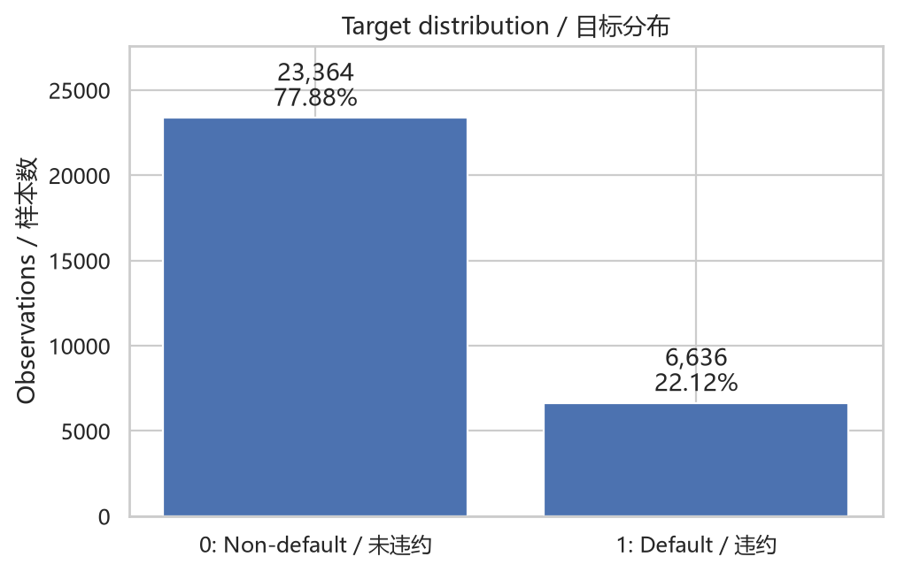
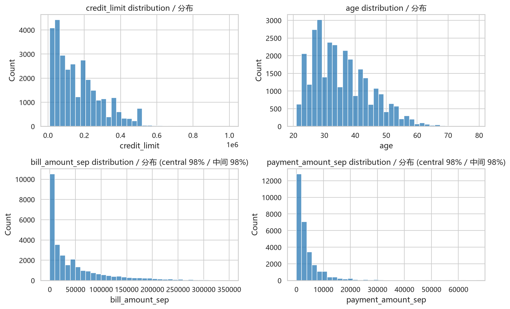
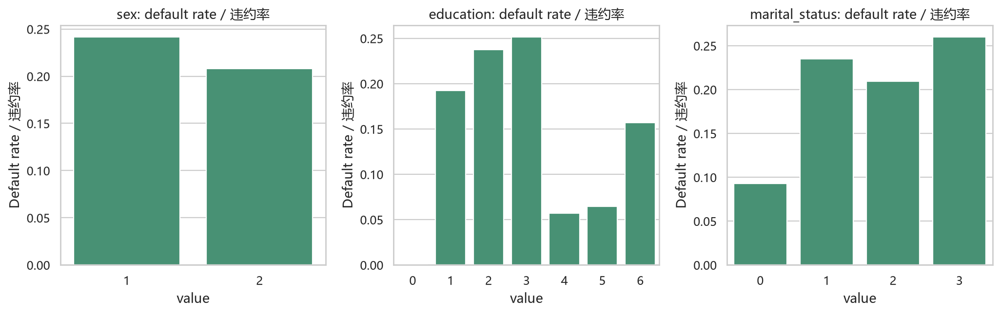
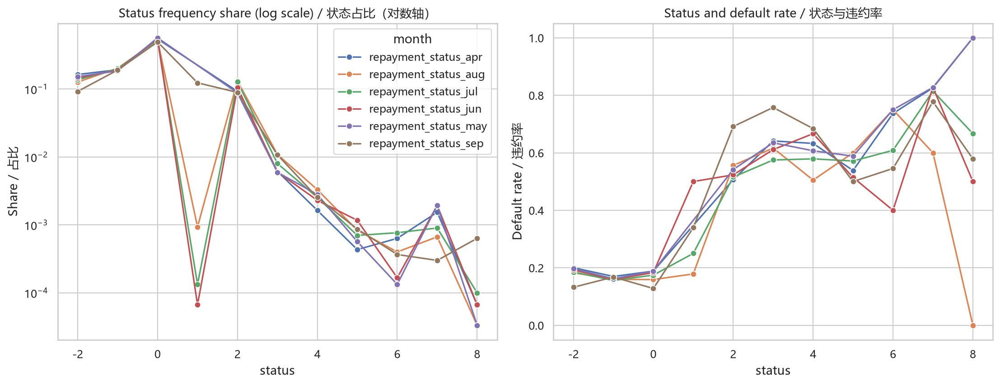
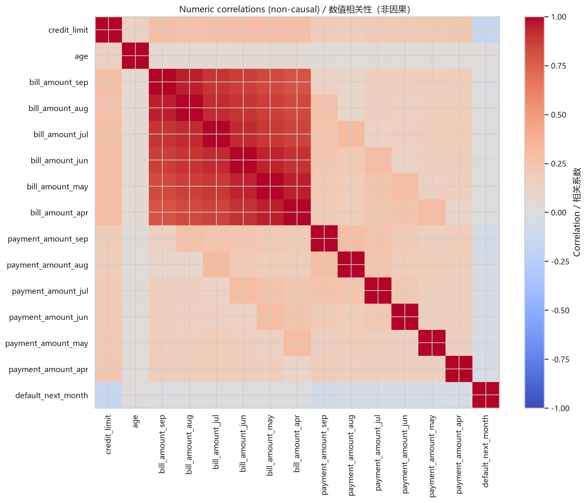
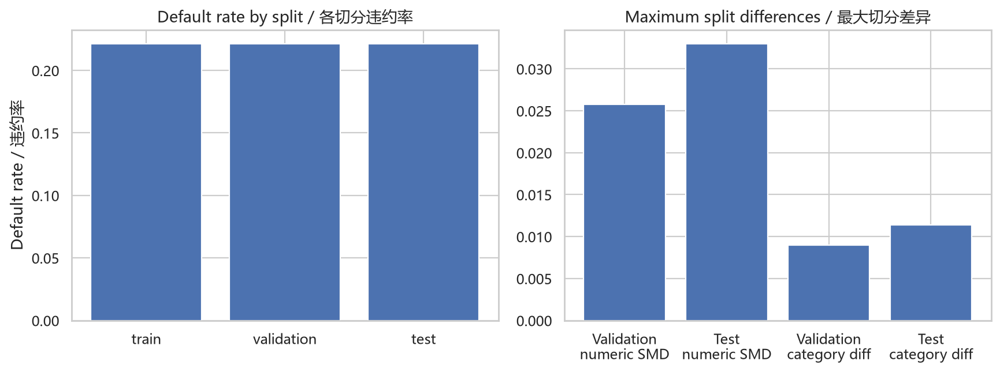

# 探索性数据分析报告（中文）

本报告由 `credit_risk.analysis` 基于经过校验的 UCI 原始数据实际运行生成。分析对象是已有客户行为风险；数据不支持真正的 OOT 验证。

## 目标分布

- 样本总数：30,000。
- 未违约（`0`）：23,364（77.88%）。
- 违约（`1`）：6,636（22.12%）。

类别存在中等不平衡，因此 Accuracy 不作为主要模型指标。后续基线使用 ROC-AUC、PR-AUC、KS、Brier Score 和校准结果。

## 数值变量

账单金额允许出现负值，付款金额存在大量零值；数据来源没有证据表明它们是录入错误，因此本阶段保留原值。金额变量明显右偏，逻辑回归 Pipeline 会在训练集内标准化，但本基线不删除、截尾或对数变换。为避免极端值压缩主体形状，金额直方图只展示中心 98% 的观察值；下表仍报告完整范围，模型仍使用全部原值。

| 变量 | 最小值 | 中位数 | P99 | 最大值 | 零值比例 | 负值比例 | 偏度 |
| --- | --- | --- | --- | --- | --- | --- | --- |
| credit_limit | 10,000.00 | 140,000.00 | 500,000.00 | 1,000,000.00 | 0.00% | 0.00% | 0.99 |
| age | 21.00 | 34.00 | 60.00 | 79.00 | 0.00% | 0.00% | 0.73 |
| bill_amount_sep | -165,580.00 | 22,381.50 | 350,110.68 | 964,511.00 | 6.69% | 1.97% | 2.66 |
| bill_amount_aug | -69,777.00 | 21,200.00 | 337,495.28 | 983,931.00 | 8.35% | 2.23% | 2.71 |
| bill_amount_jul | -157,264.00 | 20,088.50 | 325,030.39 | 1,664,089.00 | 9.57% | 2.18% | 3.09 |
| bill_amount_jun | -170,000.00 | 19,052.00 | 304,997.27 | 891,586.00 | 10.65% | 2.25% | 2.82 |
| bill_amount_may | -81,334.00 | 18,104.50 | 285,868.33 | 927,171.00 | 11.69% | 2.18% | 2.88 |
| bill_amount_apr | -339,603.00 | 17,071.00 | 279,505.06 | 961,664.00 | 13.40% | 2.29% | 2.85 |
| payment_amount_sep | 0.00 | 2,100.00 | 66,522.18 | 873,552.00 | 17.50% | 0.00% | 14.67 |
| payment_amount_aug | 0.00 | 2,009.00 | 76,651.02 | 1,684,259.00 | 17.99% | 0.00% | 30.45 |
| payment_amount_jul | 0.00 | 1,800.00 | 70,000.00 | 896,040.00 | 19.89% | 0.00% | 17.22 |
| payment_amount_jun | 0.00 | 1,500.00 | 67,054.44 | 621,000.00 | 21.36% | 0.00% | 12.90 |
| payment_amount_may | 0.00 | 1,500.00 | 65,607.56 | 426,529.00 | 22.34% | 0.00% | 11.13 |
| payment_amount_apr | 0.00 | 1,500.00 | 82,619.05 | 528,666.00 | 23.91% | 0.00% | 10.64 |

## 类别和还款状态

下表列出人口属性和最近一个月还款状态的实际频数与组内违约率。来源未定义的编码继续作为独立类别保留，不能擅自赋予业务含义。六个月还款状态图显示的是关联，不是因果关系。高还款状态编码中的小样本组会产生波动较大的违约率，不应仅根据单个点下结论。

| 变量 | 编码 | 数量 | 占比 | 违约率 |
| --- | --- | --- | --- | --- |
| sex | 1 | 11,888 | 39.63% | 24.17% |
| sex | 2 | 18,112 | 60.37% | 20.78% |
| education | 0 | 14 | 0.05% | 0.00% |
| education | 1 | 10,585 | 35.28% | 19.23% |
| education | 2 | 14,030 | 46.77% | 23.73% |
| education | 3 | 4,917 | 16.39% | 25.16% |
| education | 4 | 123 | 0.41% | 5.69% |
| education | 5 | 280 | 0.93% | 6.43% |
| education | 6 | 51 | 0.17% | 15.69% |
| marital_status | 0 | 54 | 0.18% | 9.26% |
| marital_status | 1 | 13,659 | 45.53% | 23.47% |
| marital_status | 2 | 15,964 | 53.21% | 20.93% |
| marital_status | 3 | 323 | 1.08% | 26.01% |
| repayment_status_sep | -2 | 2,759 | 9.20% | 13.23% |
| repayment_status_sep | -1 | 5,686 | 18.95% | 16.78% |
| repayment_status_sep | 0 | 14,737 | 49.12% | 12.81% |
| repayment_status_sep | 1 | 3,688 | 12.29% | 33.95% |
| repayment_status_sep | 2 | 2,667 | 8.89% | 69.14% |
| repayment_status_sep | 3 | 322 | 1.07% | 75.78% |
| repayment_status_sep | 4 | 76 | 0.25% | 68.42% |
| repayment_status_sep | 5 | 26 | 0.09% | 50.00% |
| repayment_status_sep | 6 | 11 | 0.04% | 54.55% |
| repayment_status_sep | 7 | 9 | 0.03% | 77.78% |
| repayment_status_sep | 8 | 19 | 0.06% | 57.89% |

六个月还款状态频数摘要如下。完整频数曲线使用对数纵轴，以便同时看见常见编码和极小尾部组。

| 月份字段 | 观察编码数 | 最常见编码 | 最常见占比 | 最小组样本数 |
| --- | --- | --- | --- | --- |
| repayment_status_apr | 10 | 0 | 54.29% | 2 |
| repayment_status_aug | 11 | 0 | 52.43% | 1 |
| repayment_status_jul | 11 | 0 | 52.55% | 3 |
| repayment_status_jun | 11 | 0 | 54.85% | 2 |
| repayment_status_may | 10 | 0 | 56.49% | 1 |
| repayment_status_sep | 11 | 0 | 49.12% | 9 |

## 相关性

按与目标绝对相关系数排序的前五个数值变量为：`credit_limit` (0.154), `payment_amount_sep` (0.073), `payment_amount_aug` (0.059), `payment_amount_jun` (0.057), `payment_amount_jul` (0.056)。这些相关性用于识别候选关系和共线性，不是因果证据。

## 切分分布检查

| 切分 | 违约率 |
| --- | --- |
| 训练集 | 22.12% |
| 验证集 | 22.12% |
| 测试集 | 22.12% |

- 验证集最大绝对数值 SMD：0.0258；测试集：0.0330。
- 验证集最大类别比例差：0.0090；测试集：0.0114。

这些结果仅检查分层随机切分的相似程度。观察到的差异不能称为时间漂移，也不能把该测试集称为 OOT。

## 限制

历史账单、付款和还款状态通常无法在新客户首次申请时取得，因此结果不能解释为新客户贷前审批。相关性和组间违约率差异不证明因果效应；公开教学数据也不能代表当前金融机构的真实客户组合或经济周期。

---

# Exploratory Data Analysis Report (English)

This report was generated by executing `credit_risk.analysis` against the verified UCI source data. It concerns behavioral risk for existing customers; the data do not support genuine OOT validation.

## Target distribution

- Total observations: 30,000.
- Non-default (`0`): 23,364 (77.88%).
- Default (`1`): 6,636 (22.12%).

The classes are moderately imbalanced, so Accuracy is not a primary model metric. The baseline uses ROC-AUC, PR-AUC, KS, Brier Score, and calibration results.

## Numeric features

Bill amounts can be negative and payment amounts contain many zeros. The source provides no evidence that these values are input errors, so this stage retains them. Amount features are strongly right-skewed. The logistic-regression pipeline standardizes them using training data, but this baseline does not delete, winsorize, or log-transform them. To keep extreme values from compressing the main shape, amount histograms display the central 98% of observations; the table still reports full ranges, and the model still uses every original value.

| Feature | Minimum | Median | P99 | Maximum | Zero share | Negative share | Skewness |
| --- | --- | --- | --- | --- | --- | --- | --- |
| credit_limit | 10,000.00 | 140,000.00 | 500,000.00 | 1,000,000.00 | 0.00% | 0.00% | 0.99 |
| age | 21.00 | 34.00 | 60.00 | 79.00 | 0.00% | 0.00% | 0.73 |
| bill_amount_sep | -165,580.00 | 22,381.50 | 350,110.68 | 964,511.00 | 6.69% | 1.97% | 2.66 |
| bill_amount_aug | -69,777.00 | 21,200.00 | 337,495.28 | 983,931.00 | 8.35% | 2.23% | 2.71 |
| bill_amount_jul | -157,264.00 | 20,088.50 | 325,030.39 | 1,664,089.00 | 9.57% | 2.18% | 3.09 |
| bill_amount_jun | -170,000.00 | 19,052.00 | 304,997.27 | 891,586.00 | 10.65% | 2.25% | 2.82 |
| bill_amount_may | -81,334.00 | 18,104.50 | 285,868.33 | 927,171.00 | 11.69% | 2.18% | 2.88 |
| bill_amount_apr | -339,603.00 | 17,071.00 | 279,505.06 | 961,664.00 | 13.40% | 2.29% | 2.85 |
| payment_amount_sep | 0.00 | 2,100.00 | 66,522.18 | 873,552.00 | 17.50% | 0.00% | 14.67 |
| payment_amount_aug | 0.00 | 2,009.00 | 76,651.02 | 1,684,259.00 | 17.99% | 0.00% | 30.45 |
| payment_amount_jul | 0.00 | 1,800.00 | 70,000.00 | 896,040.00 | 19.89% | 0.00% | 17.22 |
| payment_amount_jun | 0.00 | 1,500.00 | 67,054.44 | 621,000.00 | 21.36% | 0.00% | 12.90 |
| payment_amount_may | 0.00 | 1,500.00 | 65,607.56 | 426,529.00 | 22.34% | 0.00% | 11.13 |
| payment_amount_apr | 0.00 | 1,500.00 | 82,619.05 | 528,666.00 | 23.91% | 0.00% | 10.64 |

## Categories and repayment status

The table reports observed frequencies and within-group default rates for demographics and the most recent repayment status. Source-undefined codes remain separate categories and receive no invented business meaning. The six-month repayment-status figure shows associations that are not causal. Rates for small groups among high repayment-status codes are volatile and should not support conclusions from individual points.

| Feature | Code | Count | Share | Default rate |
| --- | --- | --- | --- | --- |
| sex | 1 | 11,888 | 39.63% | 24.17% |
| sex | 2 | 18,112 | 60.37% | 20.78% |
| education | 0 | 14 | 0.05% | 0.00% |
| education | 1 | 10,585 | 35.28% | 19.23% |
| education | 2 | 14,030 | 46.77% | 23.73% |
| education | 3 | 4,917 | 16.39% | 25.16% |
| education | 4 | 123 | 0.41% | 5.69% |
| education | 5 | 280 | 0.93% | 6.43% |
| education | 6 | 51 | 0.17% | 15.69% |
| marital_status | 0 | 54 | 0.18% | 9.26% |
| marital_status | 1 | 13,659 | 45.53% | 23.47% |
| marital_status | 2 | 15,964 | 53.21% | 20.93% |
| marital_status | 3 | 323 | 1.08% | 26.01% |
| repayment_status_sep | -2 | 2,759 | 9.20% | 13.23% |
| repayment_status_sep | -1 | 5,686 | 18.95% | 16.78% |
| repayment_status_sep | 0 | 14,737 | 49.12% | 12.81% |
| repayment_status_sep | 1 | 3,688 | 12.29% | 33.95% |
| repayment_status_sep | 2 | 2,667 | 8.89% | 69.14% |
| repayment_status_sep | 3 | 322 | 1.07% | 75.78% |
| repayment_status_sep | 4 | 76 | 0.25% | 68.42% |
| repayment_status_sep | 5 | 26 | 0.09% | 50.00% |
| repayment_status_sep | 6 | 11 | 0.04% | 54.55% |
| repayment_status_sep | 7 | 9 | 0.03% | 77.78% |
| repayment_status_sep | 8 | 19 | 0.06% | 57.89% |

The six-month repayment-status frequency summary follows. The full frequency panel uses a logarithmic vertical axis so both common codes and very small tail groups remain visible.

| Month field | Observed codes | Most common code | Most common share | Smallest group |
| --- | --- | --- | --- | --- |
| repayment_status_apr | 10 | 0 | 54.29% | 2 |
| repayment_status_aug | 11 | 0 | 52.43% | 1 |
| repayment_status_jul | 11 | 0 | 52.55% | 3 |
| repayment_status_jun | 11 | 0 | 54.85% | 2 |
| repayment_status_may | 10 | 0 | 56.49% | 1 |
| repayment_status_sep | 11 | 0 | 49.12% | 9 |

## Correlation

The five numeric features with the highest absolute target correlations are: `credit_limit` (0.154), `payment_amount_sep` (0.073), `payment_amount_aug` (0.059), `payment_amount_jun` (0.057), `payment_amount_jul` (0.056). These correlations help identify candidate relationships and collinearity; they are not causal evidence.

## Split-distribution checks

| Split | Default rate |
| --- | --- |
| train | 22.12% |
| validation | 22.12% |
| test | 22.12% |

- Maximum absolute numeric SMD: 0.0258 for validation and 0.0330 for test.
- Maximum category-proportion difference: 0.0090 for validation and 0.0114 for test.

These results only check similarity after a stratified random split. Observed differences are not temporal drift, and the test set is not OOT.

## Limitations

Historical bills, payments, and repayment status are generally unavailable at a new customer's first application, so results do not represent new-customer underwriting. Correlations and group default-rate differences do not prove causal effects. This public teaching dataset also does not represent a current financial institution's actual customer mix or economic cycle.
