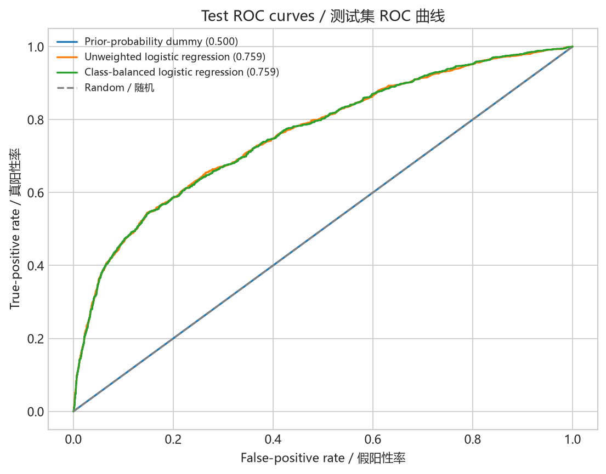
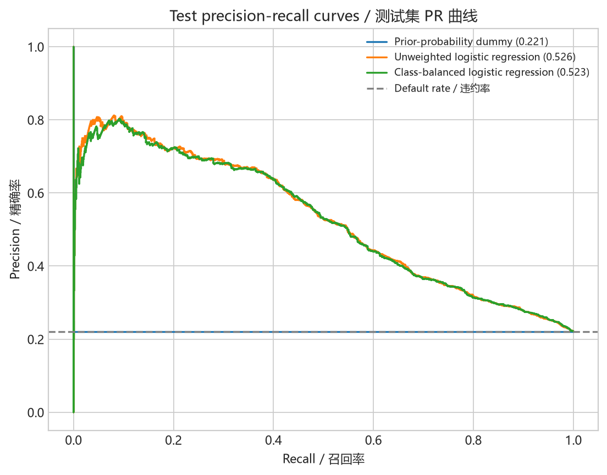
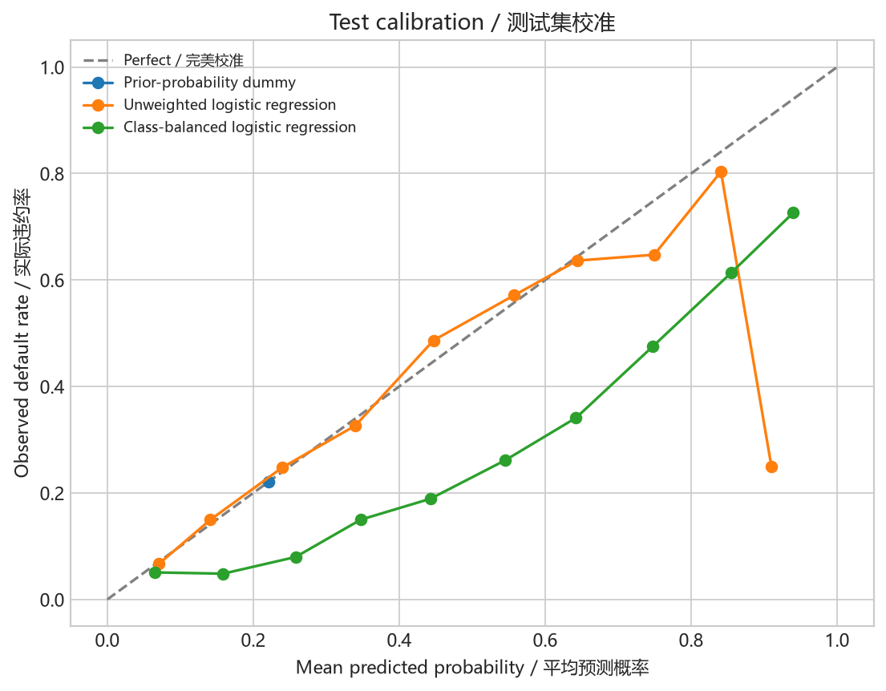
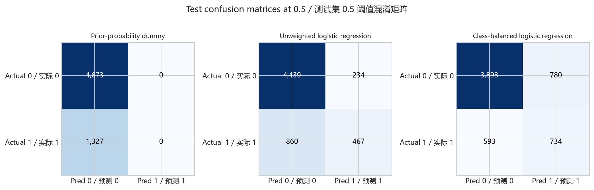

# 逻辑回归基线模型报告（中文）

本报告由 `credit_risk.experiment` 实际运行生成。数据使用固定随机种子 `42` 进行 60%/20%/20% 分层随机切分：训练集 18,000 条、验证集 6,000 条、测试集 6,000 条。该测试集不是 OOT。

## 方法

`customer_id` 被排除。类别变量在训练集内独热编码，数值变量在训练集内标准化。比较总体违约率虚拟基线、无权重逻辑回归和类别平衡逻辑回归；没有进行超参数搜索。无权重模型是主要可解释基线，加权模型只用于类别不平衡敏感性分析。

冻结参数为：`random_state=42`、`max_iter=2000`、10 个等宽概率校准箱和分类阈值 `0.5`。Dummy 使用 `strategy="prior"`；敏感性模型使用 `class_weight="balanced"`。

## 验证集结果

| 模型 | ROC-AUC | PR-AUC | KS | Brier Score | Precision @ 0.5 | Recall @ 0.5 |
| --- | --- | --- | --- | --- | --- | --- |
| 总体违约率虚拟基线 | 0.5000 | 0.2212 | 0.0000 | 0.1723 | 0.0000 | 0.0000 |
| 无权重逻辑回归 | 0.7629 | 0.5372 | 0.4156 | 0.1368 | 0.6876 | 0.3466 |
| 类别平衡逻辑回归 | 0.7627 | 0.5366 | 0.4193 | 0.1832 | 0.4974 | 0.5720 |

验证集用于比较固定模型。ROC-AUC 和 PR-AUC 衡量排序，KS 衡量分离，Brier Score 和校准图衡量概率质量；Accuracy 不作为主要指标。

校准图使用等宽概率校准箱。尾部校准箱可能包含较少样本，因此单个尾部点的波动不应被过度解释。

## 测试集冻结结果

| 模型 | ROC-AUC | PR-AUC | KS | Brier Score | Precision @ 0.5 | Recall @ 0.5 |
| --- | --- | --- | --- | --- | --- | --- |
| 总体违约率虚拟基线 | 0.5000 | 0.2212 | 0.0000 | 0.1723 | 0.0000 | 0.0000 |
| 无权重逻辑回归 | 0.7591 | 0.5258 | 0.3970 | 0.1388 | 0.6662 | 0.3519 |
| 类别平衡逻辑回归 | 0.7590 | 0.5226 | 0.3946 | 0.1857 | 0.4848 | 0.5531 |

## 0.5 阈值结果

| 模型 | TN | FP | FN | TP |
| --- | --- | --- | --- | --- |
| 总体违约率虚拟基线 | 4,673 | 0 | 1,327 | 0 |
| 无权重逻辑回归 | 4,439 | 234 | 860 | 467 |
| 类别平衡逻辑回归 | 3,893 | 780 | 593 | 734 |

固定 `0.5` 仅是透明的统计基线阈值，不是审批阈值，也不宣称业务最优。成本驱动阈值留给后续策略阶段。

## 结论与限制

逻辑回归结果应与虚拟基线比较，并同时考察区分度和概率质量。无权重与加权逻辑回归可能在概率校准和召回率之间体现不同取舍，因此本报告不把单一指标最高者称为无条件最优模型。数据描述已有客户行为风险，不能代表新客户贷前审批；随机测试集不是 OOT，也不能证明模型跨经济周期稳定。

---

# Logistic Regression Baseline Model Report (English)

This report was generated by executing `credit_risk.experiment`. A fixed random seed of `42` produces a 60%/20%/20% stratified random split with 18,000 training, 6,000 validation, and 6,000 test observations. The test set is not OOT.

## Method

`customer_id` is excluded. Categorical features are one-hot encoded and numeric features standardized using training data only. The comparison includes a prior-probability dummy, unweighted logistic regression, and class-balanced logistic regression, without hyperparameter search. The unweighted model is the primary interpretable baseline; the weighted model is only an imbalance-sensitivity analysis.

Frozen parameters are `random_state=42`, `max_iter=2000`, 10 equal-width probability calibration bins, and classification threshold `0.5`. The Dummy uses `strategy="prior"`; the sensitivity model uses `class_weight="balanced"`.

## Validation results

| Model | ROC-AUC | PR-AUC | KS | Brier Score | Precision @ 0.5 | Recall @ 0.5 |
| --- | --- | --- | --- | --- | --- | --- |
| Prior-probability dummy | 0.5000 | 0.2212 | 0.0000 | 0.1723 | 0.0000 | 0.0000 |
| Unweighted logistic regression | 0.7629 | 0.5372 | 0.4156 | 0.1368 | 0.6876 | 0.3466 |
| Class-balanced logistic regression | 0.7627 | 0.5366 | 0.4193 | 0.1832 | 0.4974 | 0.5720 |

Validation data compare the fixed models. ROC-AUC and PR-AUC measure ranking, KS measures separation, and Brier Score plus calibration measure probability quality. Accuracy is not a primary metric.

Calibration uses equal-width probability calibration bins. Tail bins can contain fewer observations, so variation in an individual tail point should not be overinterpreted.

## Frozen test results

| Model | ROC-AUC | PR-AUC | KS | Brier Score | Precision @ 0.5 | Recall @ 0.5 |
| --- | --- | --- | --- | --- | --- | --- |
| Prior-probability dummy | 0.5000 | 0.2212 | 0.0000 | 0.1723 | 0.0000 | 0.0000 |
| Unweighted logistic regression | 0.7591 | 0.5258 | 0.3970 | 0.1388 | 0.6662 | 0.3519 |
| Class-balanced logistic regression | 0.7590 | 0.5226 | 0.3946 | 0.1857 | 0.4848 | 0.5531 |

## Results at threshold 0.5

| Model | TN | FP | FN | TP |
| --- | --- | --- | --- | --- |
| Prior-probability dummy | 4,673 | 0 | 1,327 | 0 |
| Unweighted logistic regression | 4,439 | 234 | 860 | 467 |
| Class-balanced logistic regression | 3,893 | 780 | 593 | 734 |

The fixed `0.5` value is only a transparent statistical-baseline threshold. It is not an approval threshold and is not claimed to be business-optimal. Cost-driven threshold selection belongs to the later strategy stage.

## Conclusions and limitations

Logistic-regression results must be compared with the dummy baseline while considering both discrimination and probability quality. Unweighted and weighted logistic regression can express different trade-offs between calibration and recall, so this report does not call the model with the highest single metric unconditionally optimal. The data describe existing-customer behavioral risk and do not represent new-customer underwriting. The random test set is not OOT and cannot establish stability across economic cycles.
